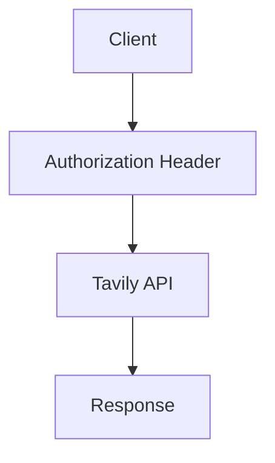

## How Authentication Works

Tavily APIs use a single API key associated with your account. Every HTTP request must include the header `Authorization: Bearer` followed by your key. SDKs handle this automatically when you configure the client.

<Callout kind="info">

All API keys are scoped to your Tavily account and carry the same capabilities unless you rotate or revoke them in the dashboard.

</Callout>

### Basic Request Flow



## Setting API Keys

### Environment Variables (Recommended)

Use an environment variable such as `TAVILY_API_KEY` and load it in your backend.

<CodeGroup tabs="Python,JavaScript">

```python
import os
from tavily import TavilyClient

client = TavilyClient(api_key=os.getenv("TAVILY_API_KEY"))
```

```javascript
import { TavilyClient } from "tavily";

const client = new TavilyClient({
  apiKey: process.env.TAVILY_API_KEY
});
```

</CodeGroup>

### Direct Configuration

You can pass the key directly when constructing the client.

<CodeGroup tabs="Python,JavaScript">

```python
from tavily import TavilyClient

client = TavilyClient(api_key="your-key-here")
```

```javascript
import { TavilyClient } from "tavily";

const client = new TavilyClient({
  apiKey: "your-key-here"
});
```

</CodeGroup>

## Client vs Server Usage

<Callout kind="alert">

Never expose your Tavily API key in public frontends, mobile apps, browser bundles, or shared repositories.

</Callout>

### Recommended Patterns

<Steps>

<Step title="Server-side API calls" icon="server">

Backend services or server frameworks should load the key from environment variables and call Tavily directly.

</Step>

<Step title="Backend-for-frontend" icon="layers">

Your frontend calls a protected backend route which then talks to Tavily using the secret key.

</Step>

<Step title="Serverless functions" icon="cloud">

Use platform secrets and keep Tavily calls inside secure serverless handlers.

</Step>

</Steps>

## Key Rotation and Revocation

<ExpandableGroup>

<Expandable title="Rotating keys" default-open="false">

- Create a new key in the Tavily dashboard.  
- Update environment variables and redeploy your application.

</Expandable>

<Expandable title="Revoking old keys" default-open="false">

- Revoke the old key in the dashboard once new deployments are active.  
- Any request using a revoked key immediately fails with an authentication error.

</Expandable>

</ExpandableGroup>

## Production Security Checklist

Columns below link to relevant pages.

<Columns cols={3}>

<Card
  title="Quickstart"
  href="/tavily/quickstart"
  icon="rocket"
  cta="View"
/>

<Card
  title="SDK Overview"
  href="/tavily/sdk/overview"
  icon="code"
  cta="Open"
/>

<Card
  title="Credits & Pricing"
  href="/tavily/api-credits"
  icon="credit-card"
  cta="Check"
/>

</Columns>

### Checklist

- Store the API key only in environment variables.  
- Never bundle the key into client-side code.  
- Use HTTPS everywhere Tavily is called.  
- Rotate keys periodically and revoke unused ones.  
- Restrict logs and traces to avoid leaking secrets.  
- Use backend integration patterns described above.  
- Monitor account usage via the dashboard to detect anomalies.
