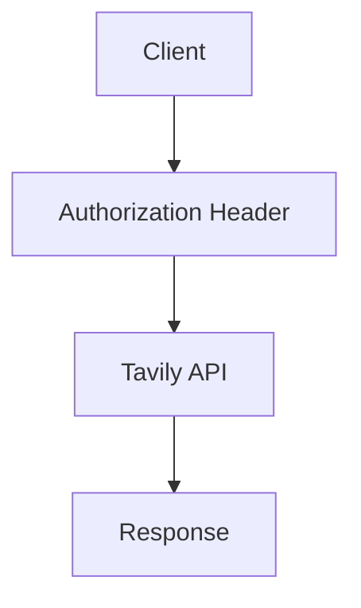

## How Authentication Works

Tavily APIs use a single API key associated with your account. Every HTTP request must include the `Authorization` header with your bearer token. SDKs handle this automatically when you configure the client.

<Callout kind="info" collapsed="false">
  All API keys are scoped to your Tavily account and carry the same capabilities until you rotate or revoke them in the dashboard.
</Callout>

### Basic Request Flow


```mermaid
graph TD
  A[Client] --> B[Authorization Header]
  B --> C[Tavily API]
  C --> D[Response]
```

## Setting API Keys

### Environment Variables (Recommended)

Use an environment variable such as `TAVILY_API_KEY` and load it in your backend service..

<CodeGroup show-lines="true" tabs={[]}>
  ```python
  import os
  from tavily import TavilyClient

  client = TavilyClient(api_key=os.getenv("TAVILY_API_KEY"))
  ```

  ```javascript
  import { TavilyClient } from "tavily";

  const client = new TavilyClient({
    apiKey: process.env.TAVILY_API_KEY
  });
  ```
</CodeGroup>

### Direct Configuration

Pass the key directly when constructing the client only when your application can keep it on the server.

<CodeGroup show-lines="true" tabs={[]}>
  ```python
  from tavily import TavilyClient

  client = TavilyClient(api_key="your-key-here")
  ```

  ```javascript
  import { TavilyClient } from "tavily";

  const client = new TavilyClient({
    apiKey: "your-key-here"
  });
  ```
</CodeGroup>

## Client vs Server Usage

<Callout kind="alert" collapsed="false">
  Never expose your Tavily API key in public frontends, mobile apps, browser bundles, or shared repositories.
</Callout>

### Recommended Patterns

<Steps>
  <Step title="Server-side API calls" icon="server" title-type="p">
    Backend services and server frameworks should load the key from environment variables and call Tavily directly.
  </Step>

  <Step title="Backend-for-frontend" icon="layers" title-type="p">
    Your frontend calls a protected backend route, which then talks to Tavily using the secret key.
  </Step>

  <Step title="Serverless functions" icon="cloud" title-type="p">
    Use platform secrets and keep Tavily calls inside secure serverless handlers.
  </Step>
</Steps>

## Key Rotation and Revocation

<ExpandableGroup>
  <Expandable title="Rotating keys" default-open="false">
    - Create a new key in the Tavily dashboard.

    - Update environment variables and redeploy your application after confirming the new key is active.
  </Expandable>

  <Expandable title="Revoking old keys" default-open="false">
    - Revoke the old key in the dashboard once new deployments are active.

    - Requests that use a revoked key fail immediately with an authentication error.
  </Expandable>
</ExpandableGroup>

## Production Security Checklist

The cards below link to related pages.

<Columns cols="3">
  <Card title="Quickstart" href="/tavily/quickstart" icon="rocket" cta="View" horizontal="false">

  </Card>

  <Card title="SDK Overview" href="/tavily/sdk/overview" icon="code" cta="Open" horizontal="false">

  </Card>

  <Card title="Credits & Pricing" href="/tavily/api-credits" icon="credit-card" cta="Check" horizontal="false">

  </Card>
</Columns>

### Checklist

- Store the API key only in environment variables.

- Never bundle the key into client-side code.

- Use HTTPS everywhere Tavily is called.

- Rotate keys periodically and revoke unused ones.

- Restrict logs and traces to avoid leaking secrets.

- Use backend integration patterns described above.

- Monitor account usage via the dashboard to detect anomalies.

