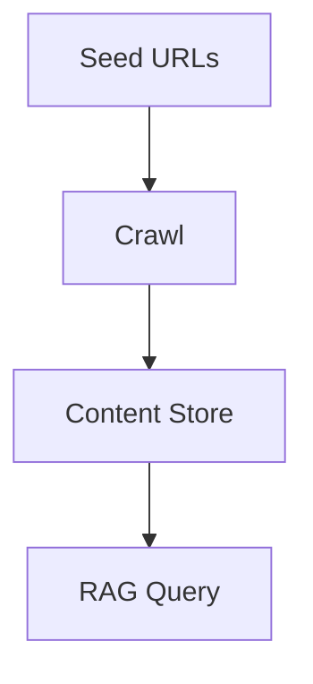

## Overview

Crawl and Map extend beyond single-page extraction by discovering and aggregating multi-page content. They enable building durable knowledge bases, domain-scoped corpora, and automated refresh pipelines. This page explains when to use Crawl, Map, or Extract, and shows production-ready patterns used in real RAG systems.

<Callout kind="info">

Crawl expands outward through links.  
Map walks structured content or internal links but stays focused.  
Extract targets a single known URL for precise content retrieval.

</Callout>

## When to Use Crawl, Map, or Extract

The table below summarizes how each endpoint behaves and where it best fits.

| Method | Ideal Use Cases | Pros | Cons | Typical Credit Footprint |
|-------|------------------|------|------|---------------------------|
| Crawl | Building corpora across websites, discovering pages, broad coverage | Automated expansion, high recall | Can grow large, must tune depth and limits | Moderate to high depending on breadth |
| Map | Domain-scoped RAG, structured docs, bounded link graphs | High precision, predictable size | Works best when link graph is tidy | Moderate and predictable |
| Extract | Targeted retrieval from known URLs | Fast, cheapest, most reliable | No discovery, one URL at a time | Low |

## Pattern 1: Build a Knowledge Base with Crawl

A common pattern is to seed Crawl with a few entry URLs, ingest results into your vector store, and serve queries from the built corpus.



<CodeGroup tabs="Python,Pseudocode" show-lines={true}>

```python
from tavily import TavilyClient
client = TavilyClient(api_key="key")

resp = client.crawl(url="https://example.com/docs", max_pages=200)

docs = []
for page in resp["results"]:
    docs.append({
        "url": page["url"],
        "text": page["content"]
    })

# embed and store in your vector DB
# example: insert_into_vector_store(docs)
```

```python
# crawl -> chunk -> embed -> store
crawl = crawl_site(seed_url)
chunks = chunk(crawl.pages)
vectors = embed(chunks)
store(vectors)
```

</CodeGroup>

<Callout kind="tip">

Tune max_pages and domain filters to prevent runaway crawls.

</Callout>

## Pattern 2: Domain-Scoped RAG with Map

Map is ideal when your content lives inside a predictable site structure, such as documentation sections or internal knowledge bases. It walks internal links within the same domain or path prefix, maintaining tighter control of the resulting corpus.

<Expandable title="Example: Scoping to a docs subsection" default-open="false">

```python
resp = client.map(
    url="https://example.com/docs/api/",
    scope="domain",  # keep traversal within example.com
    max_depth=3
)
```

</Expandable>

## Pattern 3: Scheduled Re-Crawls

Keeping a knowledge base fresh requires periodic updates without blowing through credits. Common strategies include:

<Steps>

<Step title="Use incremental schedules" icon="clock">

Schedule daily or weekly recrawls only for top-level docs or high-change pages.

</Step>

<Step title="Leverage sitemaps when available" icon="file-text">

Sitemaps provide structured hints for change frequency and priority.

</Step>

<Step title="Control scope and cost" icon="settings">

Use depth limits, max_pages caps, and filters to keep crawls predictable.

</Step>

</Steps>

## Limits, Performance and Good Citizen Practices

Building large crawls has real operational and ethical considerations. Follow these guidelines:

- Respect robots.txt and site-specific crawling policies.
- Avoid login-protected, paywalled, or user-specific content.
- Set depth and max_pages limits to prevent unbounded expansion.
- Monitor credit usage carefully via [Credits and Pricing](/tavily/api-credits) and [Rate Limits](/tavily/rate-limits).
- Use domain filters to reduce accidental cross-site crawling.

<Callout kind="alert">

Aggressive crawling can stress external sites. Keep concurrency and schedules reasonable.

</Callout>

## Related Reading

<Columns cols={3}>

<Card title="Best Practices for Crawl" href="/tavily/best-practices/crawl" icon="navigation">

Learn tuning strategies and safeguards for large crawls.

</Card>

<Card title="Best Practices for Search" href="/tavily/best-practices/search" icon="search">

Improve retrieval quality and precision.

</Card>

<Card title="RAG with Tavily" href="/tavily/use-cases/rag" icon="database">

How to integrate Tavily into RAG systems.

</Card>

</Columns>

<Columns cols={2}>

<Card title="API Reference Introduction" href="/tavily/api-reference/introduction" icon="book-open">

API concepts and usage patterns.

</Card>

<Card title="Credits and Pricing" href="/tavily/api-credits" icon="credit-card">

Understand cost models and credit consumption.

</Card>

</Columns>