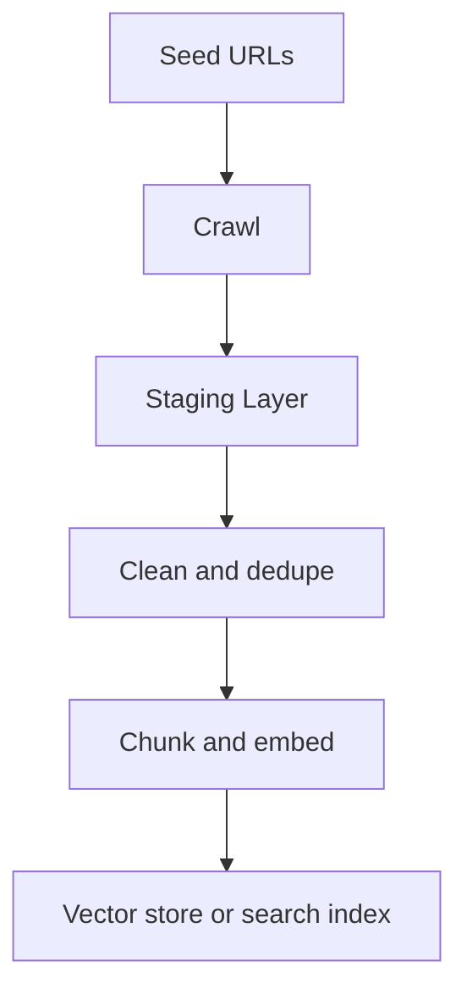

## Overview

Crawl and Map extend Tavily beyond single-page extraction by discovering and aggregating content across multiple pages. They are most useful when you need a durable corpus for RAG, a structured knowledge base, or a repeatable refresh pipeline that keeps web content current.

Use this page when you already know the kind of corpus you want to build, but need help deciding how broad the crawl should be, how to keep it bounded, and how to turn the output into something your application can reliably ingest.

<Callout kind="info">

A simple way to think about the tools:

- Crawl expands outward from seed URLs and is best for broader discovery.
- Map follows a more controlled path through a site or section.
- Extract is best when you already know the exact URL you want.

</Callout>

## When to Use Crawl, Map, or Extract

The right choice depends on how much discovery you need and how predictable the source structure is.

| Method | Best fit | Strengths | Tradeoffs |
|---|---|---|---|
| Crawl | Broad corpus collection, website discovery, large knowledge bases | High recall, discovers more pages automatically | Can expand quickly if scope is not controlled |
| Map | Documentation sections, structured sites, domain-bounded traversal | More predictable output and tighter scope | Works best when the site structure is clean |
| Extract | Known URLs, one-off retrieval, precise content capture | Fast, simple, and easy to reason about | No discovery beyond the URL you provide |

If you are building a production system, start by asking two questions:

1. Do I need discovery beyond a known URL list?
2. Can I tolerate broad traversal, or do I need a tight boundary?

If the answer to the first question is yes, start with Crawl or Map. If the answer to the second is no, prefer Map or a highly constrained Crawl job.

## Plan the job before you run it

A successful multi-page job usually starts with a small planning pass. Decide what the job should cover, how fresh the content must be, and how much output your downstream pipeline can actually store and index.

<Steps>
  <Step title="Define the corpus boundary">
    Identify the site, subdomain, or path prefix you want to include. A narrow boundary makes downstream deduplication and quality control much easier.
  </Step>
  <Step title="Pick your seed URLs">
    Start from the most authoritative entry points available, such as a documentation index, sitemap, or a top-level category page.
  </Step>
  <Step title="Set practical limits">
    Decide on depth, page count, and any domain constraints before you run the job. The goal is to prevent runaway expansion and keep the result set usable.
  </Step>
  <Step title="Plan for ingestion">
    Decide whether the output will go into a vector store, search index, cache, or knowledge graph, and define the fields you need before collection starts.
  </Step>
</Steps>

<Callout kind="tip">
If your downstream system only needs a few hundred high-value pages, cap the crawl aggressively and refine the seed list instead of trying to collect everything.
</Callout>

## Pattern 1: Build a knowledge base with Crawl

A common production pattern is to start with one or more seed URLs, collect pages into a staging layer, normalize the content, and then embed only the pages that pass your filtering rules.


```mermaid
graph TD
    A[Seed URLs] --> B[Crawl]
    B --> C[Staging Layer]
    C --> D[Clean and dedupe]
    D --> E[Chunk and embed]
    E --> F[Vector store or search index]
```

<CodeGroup tabs="Python,Pseudocode" show-lines={true}>

```python
from tavily import TavilyClient

client = TavilyClient(api_key="key")

resp = client.crawl(
    url="https://example.com/docs",
    max_pages=200,
)

staging = []
for page in resp["results"]:
    staging.append({
        "url": page["url"],
        "title": page.get("title"),
        "content": page.get("content", ""),
    })

# normalize, deduplicate, chunk, then embed
# cleaned = dedupe(staging)
# chunks = chunk(cleaned)
# store(embed(chunks))
```

```python
# high-level workflow
seed_urls = discover_entry_points()
results = crawl(seed_urls)
cleaned = normalize_and_dedupe(results)
chunks = chunk(cleaned)
index(chunks)
```

</CodeGroup>

After the crawl completes, inspect the output before it enters your knowledge base. In practice, the most common issues are duplicate pages, navigation pages with little content, and sections that are too shallow to be useful on their own.

## Pattern 2: Use Map for scoped documentation retrieval

Map is a strong choice when your source is organized into a predictable hierarchy, such as a docs site or internal help center. It is especially useful when you want a bounded set of pages without the wider expansion that can happen in a broad crawl.

<Expandable title="Example: limiting traversal to a docs subtree" default-open="false">

```python
resp = client.map(
    url="https://example.com/docs/api/",
    scope="domain",
    max_depth=3,
)
```

This pattern works well when the site has a clear entry page and the internal links stay within the same documentation area. If the structure is messy, re-check your seed URL and boundary before increasing depth.

</Expandable>

<Callout kind="info">
Map is often the better starting point when you care about predictability more than breadth. It gives you a more controlled corpus and makes cost planning easier.
</Callout>

## Normalize and ingest the output

Raw crawl results are usually not ready for indexing as-is. Before you store them, normalize the content into a consistent schema so downstream systems can process it reliably.

A practical staging schema often includes:

- `url`: the canonical page URL
- `title`: the page title, if available
- `content`: the main text payload
- `source`: crawl or map job metadata
- `fetched_at`: when the page was collected
- `hash`: a content fingerprint for deduplication

Once you have a stable schema, use it to:

- drop obvious duplicates
- remove empty or near-empty pages
- chunk long pages consistently
- preserve source URLs for later refreshes
- keep metadata for ranking and auditing

```python
import hashlib

normalized = []
for page in resp["results"]:
    content = page.get("content", "")
    normalized.append({
        "url": page["url"],
        "title": page.get("title", ""),
        "content": content,
        "hash": hashlib.sha256(content.encode("utf-8")).hexdigest(),
    })
```

<Callout kind="tip">
Keep the raw crawl output in a staging area even if you only index a subset of it. That makes debugging and recrawling much easier later.
</Callout>

## Refresh strategies

Web content changes over time, so the best crawl strategy is usually an incremental one rather than a full rebuild every time.

Use the following patterns when freshness matters:

<Steps>
  <Step title="Refresh high-value pages first">
    Update the pages that matter most to your users before spending credits on low-value or rarely accessed content.
  </Step>
  <Step title="Use scheduled recrawls">
    Run daily, weekly, or monthly refreshes based on how often the source changes.
  </Step>
  <Step title="Compare fingerprints or timestamps">
    Re-ingest only when the page content has changed enough to justify the cost.
  </Step>
  <Step title="Keep old versions when needed">
    If your application needs auditability, preserve previous snapshots instead of overwriting them immediately.
  </Step>
</Steps>

If your source has a sitemap or another obvious update signal, use it to prioritize refresh order. That approach is usually more efficient than blindly recrawling everything on a fixed schedule.

## Limits, performance, and good citizen practices

Large crawl jobs can be expensive and can create unnecessary load if you are not careful. Good operational hygiene matters as much as raw coverage.

Follow these rules:

- Respect the source site’s policies and crawl boundaries.
- Avoid login-protected, paywalled, or user-specific content.
- Set depth and page limits before the job starts.
- Use domain or path filters to avoid accidental expansion.
- Monitor credit usage and tune scope before increasing throughput.
- Prefer smaller, repeated jobs over one unbounded crawl.

<Callout kind="alert">
Aggressive crawling can overload external sites and produce noisy data. Keep concurrency and schedule frequency conservative unless you have a clear operational need to increase them.
</Callout>

## Troubleshooting common issues

If your crawl or map job feels too broad, too shallow, or too expensive, check the following first:

- The seed URL may be too broad, such as a homepage instead of a docs landing page.
- The depth setting may be too high for the site structure.
- The site may contain duplicate navigation pages that need filtering.
- The content may need normalization before indexing.
- The refresh schedule may be too aggressive for the value of the source.

A small adjustment to scope usually helps more than increasing limits.

## Related Reading

<Columns cols={3}>
  <Card title="Best Practices for Search" href="/tavily/best-practices/search" icon="search">
    Learn how to improve retrieval quality before or after a crawl.
  </Card>

  <Card title="Best Practices for Extract" href="/tavily/best-practices/extract" icon="file-text">
    Use extraction when you already know the exact URL you need.
  </Card>

  <Card title="RAG with Tavily" href="/tavily/use-cases/rag" icon="database">
    See how crawl and map workflows fit into a RAG pipeline.
  </Card>
</Columns>

<Columns cols={2}>
  <Card title="Best Practices for Using the API" href="/tavily/best-practices/use-api" icon="code">
    Keep Tavily requests focused and predictable in production workflows.
  </Card>

  <Card title="Credits & Pricing" href="/tavily/api-credits" icon="credit-card">
    Understand the operational cost of larger jobs.
  </Card>
</Columns>