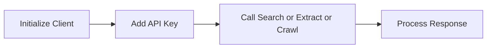

## Introduction

The Tavily SDK provides a streamlined interface for accessing Tavily Search, Extract, and Crawl APIs. This page focuses on the official Python SDK and notes other supported client libraries when relevant.

<Callout kind="info">

Use the Python SDK for the most complete and up‑to‑date feature coverage. Other ecosystem integrations are available for popular frameworks such as LangChain, LlamaIndex, and OpenAI.

</Callout>

## Installation and Setup

<Steps>
  <Step title="Install the Python SDK" icon="download">

    
```bash
pip install tavily-python
```

    
  </Step>

  <Step title="Set your API key" icon="lock">

    
Set the environment variable before running your application.

```bash
export TAVILY_API_KEY="your-api-key"
```

    
  </Step>

  <Step title="Initialize the client" icon="terminal">

    
```python
from tavily import TavilyClient

client = TavilyClient()
```

    
  </Step>
</Steps>

## Authentication

Tavily authenticates all requests with an API key. The Python SDK automatically reads the value from the environment variable named `TAVILY_API_KEY`.

<ExpandableGroup>
  <Expandable title="Using a custom environment variable" default-open="false">

    
If your deployment environment uses a different name, set it before initialization:

```bash
export MY_TAVILY_KEY="your-api-key"
```

Then pass it to the client:

```python
client = TavilyClient(api_key="your-api-key")
```

    
  </Expandable>

  <Expandable title="Verifying authentication" default-open="false">

    
A common test is to run a lightweight search and confirm a successful response.

```python
client.search(query="hello world", max_results=1)
```

    
  </Expandable>
</ExpandableGroup>

## SDK Capabilities

Below are minimal examples for each core operation.

### Search Example

<CodeGroup tabs="Python">
```python
from tavily import TavilyClient

client = TavilyClient()

response = client.search(
    query="latest AI research updates",
    max_results=5
)

print(response)
```
</CodeGroup>

### Extract Example

<CodeGroup tabs="Python">
```python
from tavily import TavilyClient

client = TavilyClient()

response = client.extract(
    url="https://example.com/article",
    include_images=False
)

print(response)
```
</CodeGroup>

### Crawl Example

<CodeGroup tabs="Python">
```python
from tavily import TavilyClient

client = TavilyClient()

response = client.crawl(
    urls=[
        "https://example.com",
        "https://example.com/docs"
    ],
    depth=1
)

print(response)
```
</CodeGroup>

## Workflow Overview



## Related Guides

<Columns cols={3}>
  <Card title="Quickstart" href="/tavily/quickstart" icon="rocket" cta="Read" />

  <Card title="API Reference" href="/tavily/api-reference/introduction" icon="book-open" cta="Explore" />

  <Card title="LangChain Integration" href="/tavily/integrations/langchain" icon="link-2" cta="View" />
</Columns>

<Columns cols={3}>
  <Card title="LlamaIndex Integration" href="/tavily/integrations/llamaindex" icon="database" cta="View" />

  <Card title="OpenAI Integration" href="/tavily/integrations/openai" icon="cpu" cta="View" />

  <Card title="Anthropic Integration" href="/tavily/integrations/anthropic" icon="sparkles" cta="View" />
</Columns>
