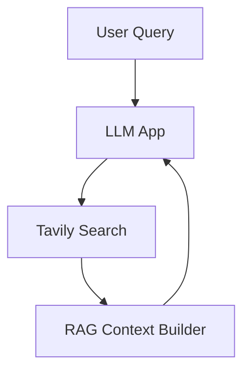
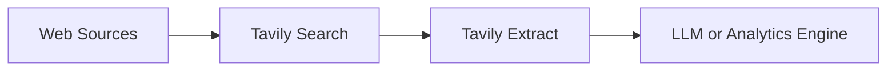

## Core Use Case Categories

Tavily provides Search, Extract, and Crawl capabilities that supply LLM systems with verified, current, and structured information. This page outlines four common categories of use cases and how Tavily fits into each.

<Callout kind="info">

Tavily is typically introduced when static context is not enough, when sources change frequently, or when a project requires high-reliability grounding from real data.

</Callout>

## RAG for LLM Applications

Retrieval augmented generation often fails when document stores are incomplete or stale. Tavily provides live, filtered web context that complements or replaces traditional vector search.

<Columns cols={3}>

<Card title="Learn RAG Basics" href="/tavily/quickstart" icon="book-open">

See how to integrate Search and Extract into a minimal RAG pipeline.

</Card>

<Card title="Improve Retrieval" href="/tavily/best-practices/search" icon="search">

Techniques for query shaping and high-quality context gathering.

</Card>

<Card title="Integrations" href="/tavily/integrations/langchain" icon="puzzle">

Use Tavily inside LangChain, LlamaIndex, OpenAI, Anthropic, and more.

</Card>

</Columns>

### How Tavily Helps

- Search provides high-relevance, source-linked context from the public web.
- Extract converts any URL into structured text for grounding or summarization.
- Crawl captures full pages or whole domains for deeper research.

### Architecture (Text Diagram)

## AI Agents and Tools

Agents depend on reliable tools for real-world reasoning. Tavily reduces hallucinations by giving agents grounded facts and structured evidence.

<Steps>

<Step title="Search for Factual Steps" icon="search">

Agents call Search to validate claims or gather multi-step evidence.

</Step>

<Step title="Extract for Detail" icon="file-text">

Extract provides clean, structured text suitable for downstream reasoning.

</Step>

<Step title="Crawl for Multi-Page Tasks" icon="navigation">

Agents can traverse deeper site structures to collect broader context.

</Step>

</Steps>

### Integration Paths

<Tabs>

<Tab title="OpenAI" icon="cpu">

Integrate through the built-in Tavily tool defined in the OpenAI spec. See the guide at `/tavily/integrations/openai`.

</Tab>

<Tab title="Anthropic" icon="sparkles">

Use Tavily inside Anthropic tool-use workflows. See `/tavily/integrations/anthropic`.

</Tab>

<Tab title="LangChain" icon="link-2">

Drop Tavily tools directly into chains or agents. See `/tavily/integrations/langchain`.

</Tab>

</Tabs>

## Analytics and Research

When analysis requires real-world signals, Tavily helps gather structured data from the public web.

<ExpandableGroup>

<Expandable title="Market and Competitor Research" default-open="false">

Teams use Extract and Crawl to build structured snapshots of competitors, pricing pages, feature lists, and news events.

</Expandable>

<Expandable title="Topic or Trend Analysis" default-open="false">

Search helps find high-signal sources, and Extract converts them into uniform text that LLMs can summarize or cluster.

</Expandable>

</ExpandableGroup>

### Architecture (Text Diagram)

## Automation and Workflows

Tavily is often used inside automation tools to power data collection or monitoring workflows.

<Columns cols={3}>

<Card title="n8n" href="/tavily/integrations/n8n" icon="tool-case">

Trigger searches or extraction jobs inside visual workflows.

</Card>

<Card title="Make" href="/tavily/integrations/make" icon="wrench">

Automate recurring research tasks and content updates.

</Card>

<Card title="Zapier" href="/tavily/integrations/zapier" icon="zap">

Connect Tavily to business processes without code.

</Card>

</Columns>

## Fit Checklist

<Callout kind="tip">

Use these criteria to evaluate whether Tavily fits your project.

</Callout>

- Your LLM needs current or verifiable information from the public web.
- You require reliable context with source URLs for audits and traceability.
- You need structured extraction for downstream reasoning, analytics, or agents.
- You want a single API that covers Search, Extract, and Crawl without operating your own crawlers.
- You plan to use existing integrations with LangChain, LlamaIndex, OpenAI, Anthropic, or workflow tools.
