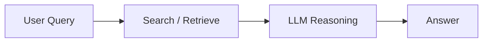

## Why Tavily for RAG

Retrieval-Augmented Generation depends on high-quality, fresh, traceable context. Tavily provides:

- Fresh, web-sourced evidence with explicit citations.
- Domain filtering to target specific verticals.
- Depth control to tune cost and recall.
- Structured outputs from Extract and multi-page traversal via Crawl.

<Callout kind="info">

Tavily complements vector databases and on-prem knowledge stores. It does not replace them; it supplies missing or fresh context your internal corpora cannot cover.

</Callout>

## Typical RAG Architectures with Tavily

The two most common patterns use Tavily either at query time or as a pre-computation step for building a knowledge base.



### Direct Web Retrieval at Query Time

This path uses Tavily Search live to enrich queries, then sends the combined context to your LLM.

### Pre-Building a Knowledge Base

This path uses Tavily Extract or Crawl to fetch structured content in bulk, then indexes it into a vector store for fast offline retrieval.

## Pattern A: Direct Web-Augmented QA

<Steps>

<Step title="Call Tavily Search" icon="search">

Use Tavily Search with domain filters and depth control to retrieve recent, cited evidence.

```python
from tavily import TavilyClient
tc = TavilyClient(api_key="YOUR_KEY")

results = tc.search(
    query="latest rust async runtime benchmarks",
    domains=["rust-lang.org"],
    max_results=5
)
```

</Step>

<Step title="Prepare RAG Context" icon="database">

Aggregate snippets, citations, and metadata from the Tavily response.

```python
context = "\n\n".join([
    f"Title: {item['title']}\nSnippet: {item['content']}"
    for item in results["results"]
])
```

</Step>

<Step title="Send to an LLM" icon="cpu">

Use your preferred orchestration. For complete examples, see the integration pages:

- [LangChain](/tavily/integrations/langchain)
- [LlamaIndex](/tavily/integrations/llamaindex)
- [OpenAI](/tavily/integrations/openai)

```python
prompt = f"Answer using evidence only.\n\nContext:\n{context}\n\nQuestion: {user_q}"
```

</Step>

</Steps>

<Callout kind="tip">

Use domain filters to reduce noise and tune max results to control cost. Fewer, higher-precision documents often beat large shotgun retrieval.

</Callout>

## Pattern B: Pre-Build Knowledge via Extract or Crawl

This pattern is ideal when you need stable, high-quality knowledge that you can embed once and reuse many times.

<ExpandableGroup>

<Expandable title="Step 1: Fetch Structured Knowledge" default-open="true">

```python
# Example: Extract highly structured product information
from tavily import TavilyClient
tc = TavilyClient(api_key="YOUR_KEY")

doc = tc.extract(
    url="https://example.com/docs/feature",
    format="markdown"
)
```

</Expandable>

<Expandable title="Step 2: Index into Your Vector Store">

```python
# Pseudo-code for indexing
chunks = chunk_text(doc["content"], size=1024)
store.add([embed(c) for c in chunks])
```

</Expandable>

<Expandable title="Step 3: Use in Retrieval-Augmented Generation">

```python
# At query time
hits = store.similarity_search(user_q, k=5)
context = "\n\n".join(hits)
```

</Expandable>

</ExpandableGroup>

## Minimal Code Reference

<CodeGroup tabs="Python,Pseudo">

```python
from tavily import TavilyClient
tc = TavilyClient(api_key="KEY")
results = tc.search(query="current ai regulation europe")
```

```python
# pseudo
results = tavily.search(q)
context = build_context(results)
answer = llm.run(context + q)
```

</CodeGroup>

## Best Practices for RAG with Tavily

### Retrieval Strategy

- Start with narrow domain filters; expand only when recall is insufficient.
- Limit `max_results` to keep irrelevant content minimal.

### Evidence Integration

- Include citations in prompts.
- Deduplicate overlapping snippets before sending them to the model.

### Cost Controls

- Prefer Extract or Crawl when you need stable corpora.
- Cache Tavily Search results for repeated queries.

### Reducing Hallucinations

- Instruct models to answer from evidence only.
- Add a verification step where the LLM checks which parts of its answer are supported.

## Additional Resources

<Columns cols={3}>

<Card
  title="Search Best Practices"
  href="/tavily/best-practices/search"
  icon="search"
>

Learn how to optimize query depth, filters, and precision.

</Card>

<Card
  title="Extract Best Practices"
  href="/tavily/best-practices/extract"
  icon="file-text"
>

Guidance for structured extraction workflows.

</Card>

<Card
  title="Crawl Best Practices"
  href="/tavily/best-practices/crawl"
  icon="navigation"
>

Learn multi-page traversal patterns and anti-noise tips.

</Card>

</Columns>
